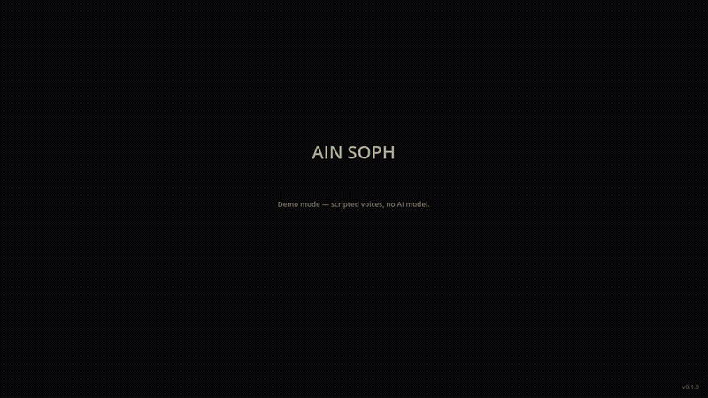

# Ain Soph

**The boundless. The infinite before form.**

Ain Soph is a free, open source, persistent, shared world game. It runs on low-spec hardware. It has no prescribed win condition. It is endlessly customizable. It is easy to run. Easy to learn. Hard to master.

Nothing phones home. No subscription. No server you don't control.



*Scripted demo tour — [video](docs/demo/tour.mp4) · [screenshots](docs/demo/). See [Demos](#demos).*

> **Status: playable alpha (0.1.0).** The world, survival, animals, NPCs, the rib, the Council, sound, menus and first-time hints all run end to end, with a 28-check self-test in CI. See [Project Status](#project-status). Try it without downloading anything large: `godot --path . -- --demo`.

## Download

**[Latest release →](https://github.com/MichaelAPerry/AinSoph/releases/latest)** — Windows installer (`AinSoph-Setup-<version>.exe`) and Linux build. Free. Needs a 64-bit CPU and 8 GB of RAM; no graphics card. The AI model is included and runs offline.

Windows may warn that the installer is from an unknown publisher (it isn't code-signed yet): **More info → Run anyway**.

---

## What It Is

A living world on a grid of sovereign cells. Every cell is its own territory. The grid expands without limit. Players and NPCs inhabit the same world simultaneously, under identical rules.

NPCs are not scripted. They are powered by a local LLM running on the player's own machine — no cloud, no API key, no latency. Each NPC has a personality drawn from 72 types, a memory of four slots that accumulates across their life, and the capacity to create content — skills, items, rules — that enters the world as equal world content.

Players and NPCs can create anything that passes the Triune Council: three LLM instances that evaluate submissions and respond in parable. The Council speaks. The world hears or it doesn't.

---

## What It Is Not

- Not pay to win
- Not pay to play
- Not platform-locked
- Not a crafting game
- Nothing phones home

---

## The World

The world is an infinite persistent grid of sovereign cells. Mental model: Game of Life. Each cell is a peer — equal containers connected to neighbors. There is no hierarchy between cells.

Each cell is an 8×8 tile grid. Each tile is 32×32 pixels. A single cell is enough space for a player to live an entire game.

All players exist on the same grid simultaneously. Only cells near a player need to be generated at any moment. There is no edge.

### Biomes

Eight biomes drawn from biblical geography. Everything starts here.

| Biome | Character |
|-------|-----------|
| Wilderness | Dry scrubland. The default. Most of the world. |
| Desert | Sand and rock. Harsh. Little grows. |
| River | Fresh water. Fertile banks. |
| Sea | Salt water. Impassable on foot. |
| Forest | Dense trees. Cedar and olive. |
| Grove | Open trees. Fig and palm. Lighter than forest. |
| Mountain | High rock. Caves concentrate here. |
| Valley | Low fertile land between mountains. |

### Manna

The only food at world start. Spawns each morning by biome density. Animals and players compete for the same supply. Lasts one day.

### Caves

A cave can hold one occupant. Inside a cave is the only safe place to sleep. Entering claims it; leaving frees it immediately.

### The Altar

One altar per world. Placed at generation in a random cell. Not marked on any map. A player must find it physically to reach the Triune Council.

---

## The Six Primitives

Every player character and NPC is born with these. They cannot be created. They can be broken or lost.

| Skill | What it does |
|-------|-------------|
| **Move** | Locomotion |
| **See** | Visual perception — 3 cells by day, 1 by night |
| **Hear** | Audio perception |
| **Talk** | Communication with NPCs and other players |
| **Reap** | Covers both killing and eating. Reap on a living target initiates kill resolution (d100). Reap on an edible item satisfies the day's food requirement. Same act. The world makes no distinction. |
| **Pray** | Reaches the Triune Council. At first does nothing visible. Discovered, not explained. |

Eating and sleeping are not skills. They are world-enforced survival requirements. Failure to eat within 24 real hours is death. Failure to sleep 8 continuous real hours within 24 is death. Warnings fire at hour 23. Bodies stay in the world.

### Interaction

Right-click any entity or tile to see all six primitives as options. Left-click to move. Any primitive can be applied to any target. The engine resolves what happens. Nonsensical combinations produce oblique responses — the world notices, but nothing useful occurs.

### Skills Beyond the Primitives

Everything beyond the six primitives is created by players and NPCs through the Council. Skills follow a taxonomy:

| Type | Definition | Example |
|------|-----------|---------|
| Primitive | Born with it | Move, See, Hear, Talk, Reap, Pray |
| Composite | Built from two or more existing skills | Weasel Hunting (Move + Hear) |
| Substitute | Replaces a broken or absent primitive | Cart (substitutes Move) |
| Extension | Amplifies an existing primitive | Telescope (extends See) |

---

## NPCs

NPCs come from players. The server does not generate them independently. A player earns their first NPC — the spouse — after 168 accumulated real hours in-world (one real week). From the spouse, progeny are born: 1 or 2 per real week. Progeny wander, intermarry, and carry lineage across the grid.

### The 72 Decans

Every NPC is assigned one of 72 personality types at creation, drawn from `data/ain_soph_72.json`. The decan governs drives, avoidances, conversational style, stress responses, economic behavior, political tendency, trust dynamics, and betrayal response. It does not change over the NPC's life.

### Memory

Each NPC has four memory slots.

| Slot | Holds |
|------|-------|
| Will | Instinct, survival, what the NPC wants at the body level |
| Thought | What the NPC knows, believes, has concluded |
| Feeling | Emotional state, relationships, what the NPC cares about |
| Action | What the NPC has done — their history of deeds |

Slots begin empty. The NPC decides what is worth writing into their own slots. Memory travels with the NPC intact when they migrate to another world.

### NPC Creation

NPCs are not passive. They can create skills, items, and rules autonomously — driven by their decan and memory. All NPC creation passes through the Triune Council under the same rules as player creation. Approved content enters the world as equal world content.

### Foreigners

An NPC that migrates from another world via a route is a foreigner. Permanently. All prior skills suspend on arrival — they cannot be recovered. Foreigners can Move, See, Hear, Talk, and Reap edible items. They cannot kill. They cannot pray to the Council. They still require food and sleep. The engine enforces this in three layers: sandboxed LLM prompt, engine override, decision-application check.

Foreigner status is permanent. There is no path to full standing. It is the condition of having crossed.

### Birth Impairment

Primitives can be absent or impaired at birth, modeled at real-world natural occurrence rates. No disease names are attached — only the mechanical reality.

| Primitive | Birth impairment rate |
|-----------|-----------------------|
| Move | ~2–3 per 1,000 |
| See | ~0.3–0.5 per 1,000 |
| Hear | ~1 per 1,000 |
| Talk | ~0.1 per 1,000 |

Impairment is a starting condition. What the character and their community build around it is the game.

---

## Kill Resolution

Reap on a living target (player, NPC, or animal) initiates resolution.

Both attacker and defender roll d100. The attacker must roll equal to or under their Reap number to kill. The defender must roll equal to or under their Reap number to resist or flee. Ties go to the defender.

| Entity | Base Reap number |
|--------|-----------------|
| Player character | 50 |
| NPC | 50 ± decan modifier |
| Predator animal (lion, wolf, bear, eagle) | 80 |
| Neutral animal (horse, donkey, ox) | 20 |
| Prey animal (sheep, deer, rabbit, dove) | 10 |
| Insect (locust) | 5 |

When an animal dies, two spawn adjacent immediately. Animal populations self-replenish by design.

---

## Survival

| Requirement | Rule |
|-------------|------|
| Eat | Once per 24 real hours. Satisfied by Reap on any edible item. Warning at hour 23. Death at hour 24. |
| Sleep | 8 continuous real hours per 24-hour window. Warning at hour 23. Death at hour 24. |
| Safe sleep | Inside a claimed cave only. One occupant per cave. |
| Exposed sleep | Outside a cave. Vulnerable to Reap rolls from any entity. |
| Logout | Character persists in the world sleeping. If not in a cave, they are exposed. The world does not pause. |

The SLEEP button appears in the HUD after 8 real hours of being awake. Clicking it begins sleep. Logging out while awake does the same automatically. The game auto-wakes the character after 8 continuous hours.

---

## The Triune Council

The Council evaluates all created content — player or NPC — before it enters the world.

Three seats: Skills, Items, Rules. All three vote on every submission. Pass condition: 2 of 3.

Reached through the altar, using the Pray primitive. The altar is not marked. Finding it is part of the game.

The Council does not speak in technical terms. It responds in homily, allegory, or story — biblical in register. When you ask for a fishing pole, it may show you a broken tree and speak of an ant. The player interprets the response. The world does not explain itself plainly.

All three homilies are delivered regardless of whether the submission passes or fails. The Council does not negotiate. It does not accept appeals.

---

## Death

When a player or NPC dies, their body remains in the world as an item. It is physical. Other players and NPCs can interact with it. What happens to it is up to them.

**Player death:** The player's body stays. The player creates a new character with no continuity — no knowledge of the old character's location, possessions, or history. The new character descends.

---

## Routes

A route is a connection between two player worlds. Both players must consent. Neither can open one unilaterally.

When a route opens, up to 1/10 of the NPC population near each border migrates. Selection is random. The migrating NPC's decan and all four memory slots travel intact. They arrive in the new world as foreigners, permanently.

Exported NPCs are removed from the origin world. They don't come back.

---

## Time

Time is real. The world clock syncs to the player's local clock. 24 real hours is 24 world hours. Skills that cost time cost real time. A player can perform an action actively or set a character to perform it and walk away. The world does not judge.

---

## Forking

The entire world can be forked. A forked world is a legitimate world. It runs independently.

Forking is not punished. It is designed for.

---

## Stack

| Component | Choice |
|-----------|--------|
| Engine | Godot 4.4 |
| Language | C# |
| Build | .NET SDK 8.0 |
| LLM Runtime | llama.cpp via LLamaSharp |
| Model | Qwen 2.5 1.5B Instruct, Q4_K_M (~1 GB, Apache 2.0) |
| Min Hardware | 8 GB RAM, CPU-only, x86_64 |
| Platforms | Windows, Linux |

---

## Running From Source

### Requirements

- [Godot 4.4 (.NET)](https://godotengine.org/download)
- [.NET SDK 8.0+](https://dotnet.microsoft.com/download)
- Godot export templates (only needed for building — not for running in editor)

### Model

Download and rename to `qwen2.5-1.5b.gguf`:

```
https://huggingface.co/Qwen/Qwen2.5-1.5B-Instruct-GGUF/resolve/main/qwen2.5-1.5b-instruct-q4_k_m.gguf
```

Place it at:

```
<project root>/models/qwen2.5-1.5b.gguf
```

This file is in `.gitignore`. Do not commit it.

### Run

1. Open the project in Godot 4.4
2. **Build → Build Solution** (or `dotnet build` in the project root)
3. Press **Play**

The model file will be found in `models/` during development. In production builds it is extracted from the PCK on first launch.

No model? The game still runs in demo mode — see [Command-line options](#command-line-options).

### Controls

| Input | Action |
|-------|--------|
| WASD / arrow keys / left-click | Walk one tile at a time |
| Left-click an NPC | Open the six primitives on them |
| Right-click a tile | Primitives on that tile, or on the item lying there (manna, bodies) |
| Talk | Opens dialogue — type, then Enter or SEND; Esc or LEAVE to close |
| Reap | Eat an edible item next to you, or attack a being next to you (animals too — a clean animal's body is food) |
| Pray | Only reaches the Council when you stand at the altar |
| SLEEP button | Sleep / wake. Sleep inside a cave to be safe |
| RIB button | Appears once you have earned the rib — name and describe your spouse |
| ROUTES button | Export / import travellers between worlds |
| Esc | Menu — fullscreen, music / ambience / effects volume, hints, controls, quit. The world does not pause. |

### Command-line options

Pass these after `--` (e.g. `godot --path . -- --demo`), or set them in **Project → Project Settings → Editor → Run → Main Run Args**.

| Option | Effect |
|--------|--------|
| `--demo` | Scripted NPC and Council voices, no model needed. A few NPCs are placed near you and think every few seconds. |
| `--model=<path>` | Use any `.gguf` file instead of the bundled model (handy for testing with a small model). |
| `--demo-tour` | Plays a hands-free walkthrough with captions, then quits. Uses a throwaway world, never your save. Scripted voices unless `--model=` is also given. |
| `--shots=<dir>` | With `--demo-tour`: save a screenshot at each step. |
| `--grant-rib` | Testing only: grant the rib now instead of after 168 hours of play. |
| `--selftest` | Runs 28 automated checks in a throwaway world, prints PASS/FAIL, exits 0 or 1. Scripted voices unless `--model=` is given. |

If no model is found at all, the game starts in demo mode automatically instead of stopping at the boot screen.

---

## Demos

Everything in [`docs/demo/`](docs/demo/) is produced by the scripted tour:

| | |
|---|---|
|  |  |
|  |  |

The recorded tour uses scripted voices so it plays the same every time. With the real model (Qwen 2.5 1.5B) it looks like this:

| NPC dialogue | The Council |
|---|---|
|  |  |

Re-record it (video, GIF and screenshots) with:

```
GODOT=/path/to/Godot_v4.4.1-stable_mono_linux.x86_64 tools/record-demo.sh
```

Needs ffmpeg; runs under `xvfb-run` on a headless machine. Add `--model=/path/to/model.gguf` to record with the real LLM.

---

## Code Map

All game code is C# under `scripts/`. There are no hand-built scenes beyond two stubs — `GameRoot` (an autoload) builds everything at runtime.

| Path | What lives there |
|------|------------------|
| `scripts/GameRoot.cs` | Boot sequence, save/load, NPC queue pump, player interactions (talk, reap, pray, eat), Council verdicts |
| `scripts/WorldScene.cs` | The visible world: camera, player sprite, movement, input, NPC nodes |
| `scripts/World/` | Grid of cells, deterministic cell generation, biomes, caves, altar, manna, animal species, survival clock, kill resolution |
| `scripts/NPC/` | `NpcBrain` (think tick → LLM → decision), prompts, memory slots, the 72 decans, animals |
| `scripts/Council/` | The Triune Council: three seats, three LLM calls, 2-of-3 vote |
| `scripts/LLM/LlmRunner.cs` | llama.cpp via LLamaSharp — ChatML prompts for Qwen, one inference at a time, tolerant JSON parsing |
| `scripts/LLM/DemoResponder.cs` | Scripted replies used when no model is loaded (demo mode) |
| `scripts/LLM/ContentFilter.cs` | Prompt rule + word-list filter (`data/blocklist.txt`) on everything the AI says |
| `scripts/Audio/Sound.cs` | Music, ambience and effects on their own buses (`assets/audio/`, made by `tools/make-sounds.py`) |
| `scripts/Demo/DemoDirector.cs` | The captioned `--demo-tour` walkthrough and screenshot capture |
| `scripts/Demo/SelfTest.cs` | `--selftest`: 28 automated checks of the whole loop, exit code 0/1 |
| `scripts/Player/` | The player character, play-time tracking and the rib, `TribeManager` (spouse, weekly progeny, lineage) |
| `scripts/UI/` | Renderer (biome ground shader + Kenney 1-bit tiles), HUD, primitive menu, dialogue, portraits, boot screen, character and spouse creation, routes, Esc menu and settings, first-time hints |
| `scripts/Data/` | Save files (JSON under `user://saves/`), NPC tick queue, routes |
| `tools/record-demo.sh` | Records the demo tour to `docs/demo/` |
| `tools/build-steam.sh` | Steam-ready Windows and Linux folders in `build/steam/` |
| `tools/package-windows.sh` | Windows installer `build/AinSoph-Setup-<version>.exe` (NSIS script in `tools/installer/`) |
| `.github/workflows/` | CI (build + self-test on every push) and Release (installer + Linux build on a `v*` tag) |

Saves and settings live in `%APPDATA%\AinSoph` on Windows and `~/.local/share/AinSoph` on Linux (`saves/world/`, `settings.cfg`, `logs/`). Delete `saves/world` to start a new world.

---

## Project Status

**Works now:**
- **World** — generation (the same world every launch for a seed), fog of war, biomes, caves, the hidden altar, morning manna.
- **Survival on real time** — hunger and sleep, warnings, death, safe sleep in caves. Saved: time away counts, and logging out is sleeping where you stand.
- **People** — four founding travellers in every new world; NPCs that think, move, talk in character, remember, and take their creations to the Council; dialogue.
- **Animals** — 30 species from ITEMS.md; they wander, eat manna, hunt and flee; clean ones are food.
- **The rib** — earned after a week of play, named and described by you; weekly children with lineage.
- **The Council** — three seats, parables, 2-of-3 votes; approved skills, items and rules enter the world, and rules become laws every NPC lives by.
- **Routes** — send travellers to another world and receive theirs.
- **Polish** — music, ambience and sound effects; Esc menu with settings; first-time hints; survival status on screen; an output filter on everything the AI says.

**Not yet:** controller / Steam Deck input, and a full real-week playthrough on the shipped model. See [STEAM.md](STEAM.md) for the release checklist.

---

## Building a Distributable

Needs the Godot 4.4.1 .NET export templates and `models/qwen2.5-1.5b.gguf`. For Steam:

```
GODOT=/path/to/Godot_v4.4.1-stable_mono_linux.x86_64 tools/build-steam.sh
```

This produces `build/steam/windows/` and `build/steam/linux/`. Each is a folder (the executable, a `data_AinSoph_*` folder with the .NET and llama.cpp libraries, and `models/`), about 1.3 GB. The plain **Windows Desktop** / **Linux/X11** presets bundle the model inside the game package and extract it on first launch instead.

For a Windows installer — one `AinSoph-Setup-0.1.0.exe` that installs the game, adds Start-menu and desktop shortcuts, and an uninstaller:

```
GODOT=/path/to/Godot_v4.4.1-stable_mono_linux.x86_64 tools/package-windows.sh
```

Full details in [BUILD.md](BUILD.md); the road to release in [STEAM.md](STEAM.md).

---

## Documentation

| Document | Contents |
|----------|----------|
| [VISION.md](VISION.md) | What this is and why |
| [WORLD.md](WORLD.md) | The grid, cells, and world structure |
| [NPCS.md](NPCS.md) | NPC architecture, memory, and creation |
| [TRIBES.md](TRIBES.md) | The rib, progeny, and lineage |
| [SKILLS.md](SKILLS.md) | The six primitives and skill taxonomy |
| [ITEMS.md](ITEMS.md) | Items, animals, and the starting world |
| [RULES.md](RULES.md) | World physics |
| [COUNCIL.md](COUNCIL.md) | The Triune Council and its prompts |
| [TECH.md](TECH.md) | All technical decisions |
| [BUILD.md](BUILD.md) | Full build instructions |
| [STEAM.md](STEAM.md) | What is ready for Steam and what is left |
| [data/ain_soph_72.json](data/ain_soph_72.json) | The 72 NPC personality seeds |

---

## Licenses

**Game code:** MIT — see [LICENSE](LICENSE).

**Art:** [Kenney](https://kenney.nl) 1-bit pack and Modular Characters, CC0 (`assets/sprites/*/LICENSE.txt`).

**Runtime:** [LLamaSharp](https://github.com/SciSharp/LLamaSharp) and [llama.cpp](https://github.com/ggml-org/llama.cpp), both MIT. [Godot](https://godotengine.org), MIT.

**Model:** [Qwen 2.5 1.5B Instruct](https://huggingface.co/Qwen/Qwen2.5-1.5B-Instruct-GGUF), Apache 2.0 — fine to bundle in a commercial build. (Ain Soph used the 3B size before; that one is under the Qwen Research License, which restricts commercial use.) The model is not in this repository.

The game is free. The world can be forked. Forking is not punished. It is designed for.

Named by Michael Perry.
