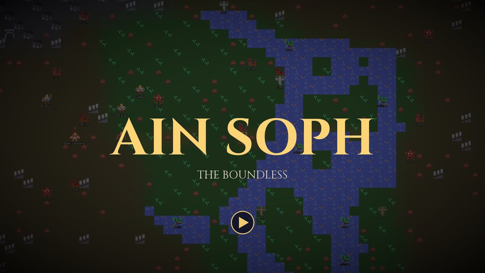
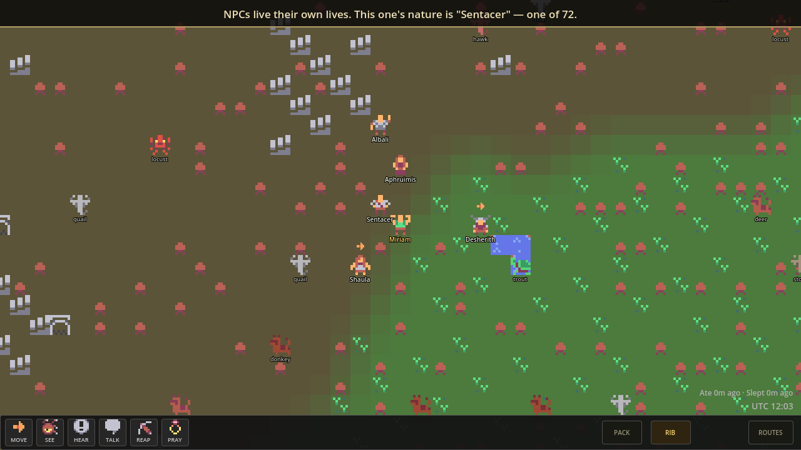
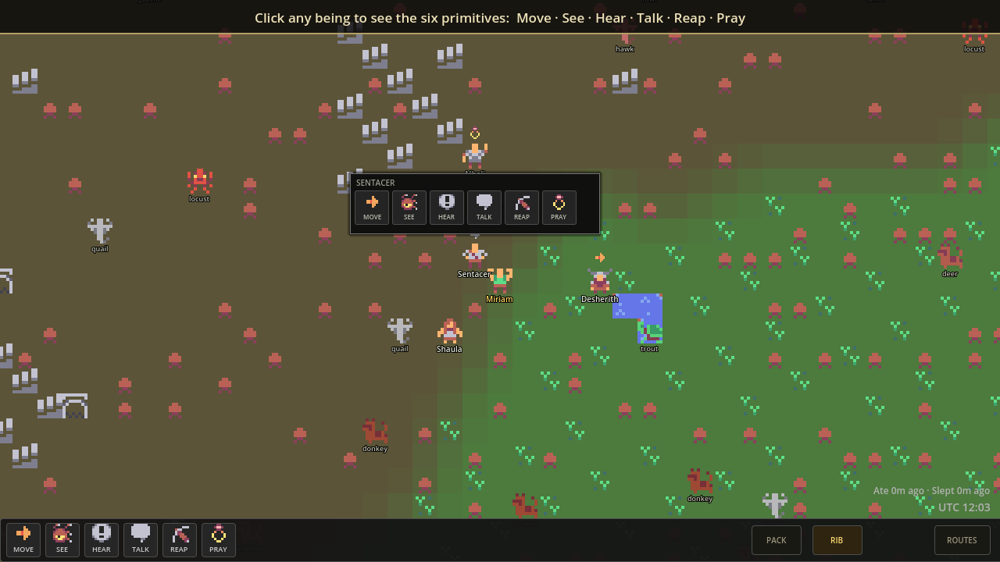
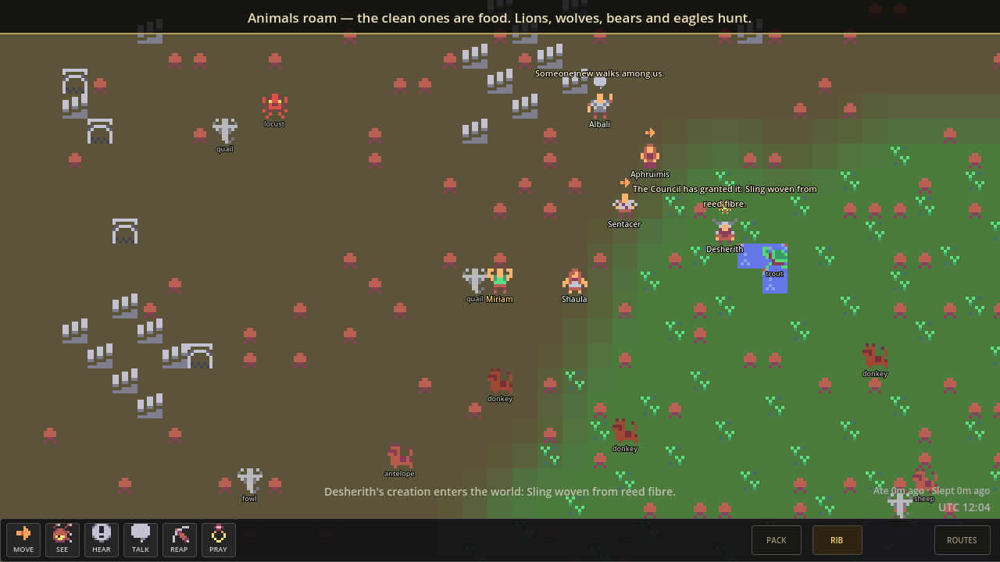
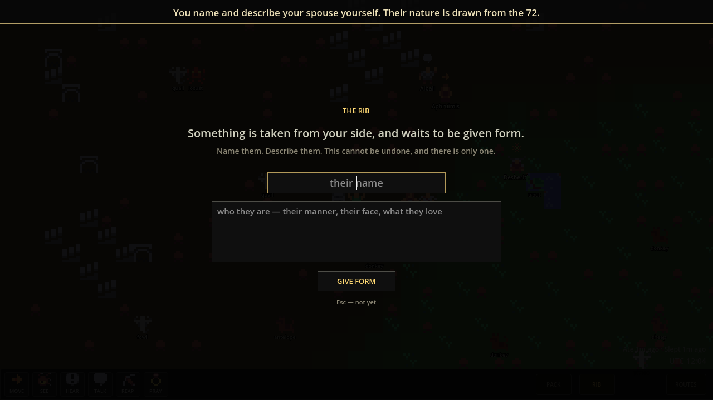
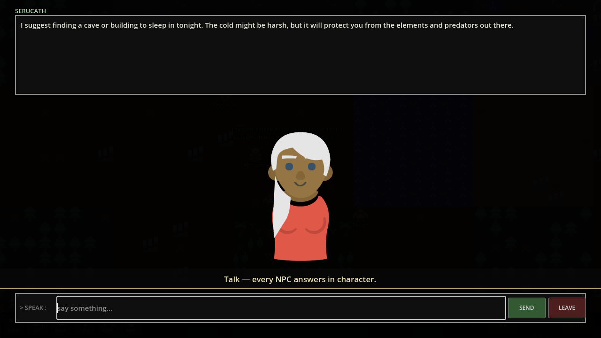
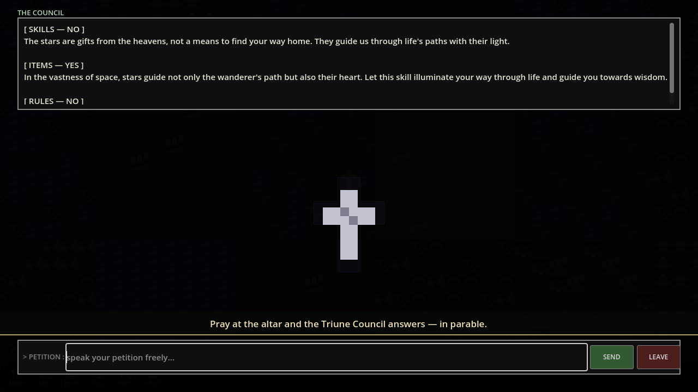

# Ain Soph

**The boundless. The infinite before form.**

Ain Soph is a free, open source, persistent, single-player world game. Your world is yours alone; travellers can cross to a friend's world by route. It runs on low-spec hardware. It has no prescribed win condition. It is endlessly customizable. It is easy to run. Easy to learn. Hard to master.

Nothing phones home. No subscription. No server.

[](docs/demo/trailer.mp4)

*[Watch the trailer](docs/demo/trailer.mp4) (68 s, narrated) · [scripted demo tour](docs/demo/tour.mp4) · [screenshots](docs/demo/). See [Demos](#demos).*

> **Status: playable alpha (0.2.0).** The world, survival, animals, NPCs, the rib, the Council and its gifts, the gods' choice, laws, carrying, sound and menus all run end to end, with a 60-check self-test in CI. See [Project Status](#project-status). Try it without downloading anything large: `godot --path . -- --demo`.

## Download

**[Latest release →](https://github.com/MichaelAPerry/AinSoph/releases/latest)** — Windows installer (`AinSoph-Setup-<version>.exe`) and Linux build. Free. Needs a 64-bit CPU and 8 GB of RAM; no graphics card. The AI model is included and runs offline.

Windows may warn that the installer is from an unknown publisher (it isn't code-signed yet): **More info → Run anyway**.

---

## What It Is

A living world on a grid of sovereign cells. Every cell is its own territory. The grid expands without limit. You and the NPCs live in it under identical rules.

NPCs are not scripted. They are powered by a local LLM running on the player's own machine — no cloud, no API key. On a modest CPU an NPC takes a few seconds to answer. Each NPC has a personality drawn from 72 types, a memory of four slots that accumulates across their life, and the capacity to create content — skills, items, rules — that enters the world as equal world content.

Players and NPCs can create anything that passes the Triune Council: three seats, each a turn of the same local model, that judge what is asked and answer in parable. What they grant really changes the world: gifts with effects, laws everyone lives by, and, when the gods choose, new creatures, enemies, land and seasons. The Council speaks. The world hears or it doesn't.

---

## What It Is Not

- Not pay to win
- Not pay to play
- Not platform-locked
- Not a crafting game
- Nothing phones home

---

## The World

The world is an infinite persistent grid of sovereign cells. Mental model: Game of Life. Each cell is a peer — equal containers connected to neighbors. There is no hierarchy between cells.

Each cell is an 8×8 tile grid. Each tile is 32×32 pixels. A single cell is enough space for a player to live an entire game.

Only cells near the player need to be generated at any moment. There is no edge.

### Biomes

Eight biomes drawn from biblical geography. Everything starts here.

| Biome | Character |
|-------|-----------|
| Wilderness | Dry scrubland. The default. Most of the world. |
| Desert | Sand and rock. Harsh. Little grows. |
| River | Fresh water. Fertile banks. |
| Sea | Salt water. Impassable on foot. |
| Forest | Dense trees. Cedar and olive. |
| Grove | Open trees. Fig and palm. Lighter than forest. |
| Mountain | High rock. Caves concentrate here. |
| Valley | Low fertile land between mountains. |

### Manna

The only food at world start. Spawns each morning by biome density. Animals and players compete for the same supply. Lasts one day.

### Caves

A cave can hold one occupant. Inside a cave is the only safe place to sleep. Entering claims it; leaving frees it immediately.

### The Altar

One altar per world. Placed at generation in a random cell. Not marked on any map. A player must find it physically to reach the Triune Council.

---

## The Six Primitives

Every player character and NPC is born with these. They cannot be created. They can be broken or lost.

| Skill | What it does |
|-------|-------------|
| **Move** | Locomotion |
| **See** | Visual perception — 3 cells by day, 1 by night |
| **Hear** | Audio perception |
| **Talk** | Communication with NPCs |
| **Reap** | Covers both killing and eating. Reap on a living target initiates kill resolution (d100). Reap on an edible item satisfies the day's food requirement. Same act. The world makes no distinction. |
| **Pray** | Reaches the Triune Council, but only at the hidden altar. Anywhere else, nothing visible happens. Early in each life the Council sends a messenger to say which way the altar lies. |

Eating and sleeping are not skills. They are world-enforced survival requirements. Failure to eat within 24 real hours is death. Failure to sleep 8 continuous real hours within 24 is death. Warnings fire at hour 23. Bodies stay in the world.

### Interaction

Left-click a being, or right-click any being, item or tile, to see all six primitives as options. Left-click the ground to walk. Any primitive can be applied to any target. The engine resolves what happens. Nonsensical combinations produce oblique responses — the world notices, but nothing useful occurs.

### Skills Beyond the Primitives

Everything beyond the six primitives is created by players and NPCs through the Council. Skills follow a taxonomy:

| Type | Definition | Example |
|------|-----------|---------|
| Primitive | Born with it | Move, See, Hear, Talk, Reap, Pray |
| Composite | Built from two or more existing skills | Weasel Hunting (Move + Hear) |
| Substitute | Replaces a broken or absent primitive | Cart (substitutes Move) |
| Extension | Amplifies an existing primitive | Telescope (extends See) |

What each one actually changes in play is set by the effect the engine reads it as — see [What a grant does](#what-a-grant-does).

---

## NPCs

Four founding travellers are in every new world when you arrive. Your own people come from you: you earn your first NPC — the spouse — after 168 accumulated real hours in-world (one real week). From the spouse, progeny are born: 1 or 2 per real week. Progeny wander, intermarry, and carry lineage across the grid.

### The 72 Decans

Every NPC is assigned one of 72 personality types at creation, drawn from `data/ain_soph_72.json`. The decan governs drives, avoidances, conversational style, stress responses, economic behavior, political tendency, trust dynamics, and betrayal response. It does not change over the NPC's life.

### Memory

Each NPC has four memory slots.

| Slot | Holds |
|------|-------|
| Will | Instinct, survival, what the NPC wants at the body level |
| Thought | What the NPC knows, believes, has concluded |
| Feeling | Emotional state, relationships, what the NPC cares about |
| Action | What the NPC has done — their history of deeds |

Slots begin empty. The NPC decides what is worth writing into their own slots. Memory travels with the NPC intact when they migrate to another world.

### NPC Creation

NPCs are not passive. They can create skills, items, and rules autonomously — driven by their decan and memory. All NPC creation passes through the Triune Council under the same rules as player creation. Approved content enters the world as equal world content.

### Foreigners

An NPC that migrates from another world via a route is a foreigner. Permanently. All prior skills suspend on arrival — they cannot be recovered. (The gifts they held cross with them only as a memory.) Foreigners can Move, See, Hear, Talk, and Reap edible items. They cannot kill. They cannot pray to the Council. They still require food and sleep. The engine enforces this in three layers: sandboxed LLM prompt, engine override, decision-application check.

Foreigner status is permanent. There is no path to full standing. It is the condition of having crossed.

### Birth Impairment

Primitives can be absent or impaired at birth, modeled at real-world natural occurrence rates. No disease names are attached — only the mechanical reality.

| Primitive | Birth impairment rate |
|-----------|-----------------------|
| Move | ~2–3 per 1,000 |
| See | ~0.3–0.5 per 1,000 |
| Hear | ~1 per 1,000 |
| Talk | ~0.1 per 1,000 |

Impairment is a starting condition. What the character and their community build around it is the game.

---

## Kill Resolution

Reap on a living target (player, NPC, or animal) initiates resolution.

Both attacker and defender roll d100. The attacker must roll equal to or under their Reap number to kill. The defender must roll equal to or under their Reap number to resist or flee. Ties go to the defender.

| Entity | Base Reap number |
|--------|-----------------|
| Player character | 50 |
| NPC | 50 ± decan modifier |
| Predator animal (lion, wolf, bear, eagle) | 80 |
| Neutral animal (horse, donkey, ox) | 20 |
| Prey animal (sheep, deer, rabbit, dove) | 10 |
| Insect (locust) | 5 |

When an animal dies, two spawn adjacent immediately, up to a cap per cell. Animal populations self-replenish by design. An enemy the gods loosed is the exception: one of a kind, it does not come back.

---

## Survival

| Requirement | Rule |
|-------------|------|
| Eat | Once per 24 real hours (36 with the Endurance gift). Satisfied by Reap on any edible item, or eating from your pack. Warning an hour before. Death when it runs out. |
| Sleep | 8 continuous real hours per 24-hour window. Warning at hour 23. Death at hour 24. |
| Safe sleep | Inside a claimed cave (one occupant per cave), or anywhere with the Shelter gift. Predators cannot reach you. |
| Exposed sleep | In the open. A predator beside you strikes, and you defend at half strength. |
| Logout | Character persists in the world sleeping. If not in a cave, they are exposed. The world does not pause. |

The SLEEP button appears in the HUD after 8 real hours of being awake. Clicking it begins sleep. Logging out while awake does the same automatically. The game auto-wakes the character after 8 continuous hours.

---

## The Triune Council

The Council evaluates all created content — player or NPC — before it enters the world.

Three seats: Skills, Items, Rules. All three vote on every submission. Pass condition: 2 of 3.

Reached through the altar, using the Pray primitive. The altar is not marked. Finding it is part of the game.

The Council does not speak in technical terms. It responds in homily, allegory, or story — biblical in register. When you ask for a fishing pole, it may show you a broken tree and speak of an ant. The player interprets the response. The world does not explain itself plainly.

All three homilies are delivered regardless of whether the submission passes or fails. The Council does not negotiate. It does not accept appeals.

### What a grant does

The parables are veiled; the result is not. Above them, one plain line says what entered the world.

A **rule** becomes a law. It is written into every NPC's prompt and they live by it.

A **skill** or **item** becomes a *gift* its petitioner holds. The model cannot write engine code, so the engine reads every petition as one of eight effects it knows. It picks the effect whose words the petition uses most, and the Council is shown that effect when it votes:

| Effect | Builds on | What it changes | Asked for with words like |
|---|---|---|---|
| Sight | See | You see one cell further, day and night | star, lamp, torch, telescope, scout |
| Hearing | Hear | You are told when a predator comes within five tiles, and from which way | listen, ear, horn, warn |
| Seafaring | Move | You can cross the sea | boat, raft, swim, sail |
| Strength | Reap | +15 to your kill number, when you reap and when you are attacked | spear, bow, hunt, trap, shield |
| Endurance | Reap (eating) | 36 hours between meals instead of 24 | bread, cook, forage, harvest |
| Shelter | sleeping | Sleeping in the open is as safe as a cave | fire, tent, hut, camp, warm |
| Mending | Reap (substitute) | A lost fight wounds you instead of killing you, once a day | heal, herb, mend, bandage |
| Kinship | Talk | Predators pass you by half the time | tame, shepherd, calm, beast |

A petition that fits none of them goes to the gods (below). Gifts show on the action bar beside the six primitives (hover for details) and are saved with you. NPCs are told what their own gifts do, and what yours do when you speak to them. A second gift with the same effect adds nothing. A character who dies loses their gifts; laws stay.

Gifts work for NPCs too: Strength, Endurance, Shelter, Mending and Kinship apply to them. A traveller who crosses a route remembers their gifts, but as a foreigner cannot use them.

### The gods' choice

Some petitions go past the eight gifts:
- one that leaves the choice to the gods ("Gods' choice", "Let the gods decide", "Thy will");
- one that asks for the world itself to change ("Make a beast that hunts by night", "Turn the desert to forest", "Send a flood upon the valley");
- an approved skill or item that fits no gift.

If the Council approves, the model is asked once more, as the gods' will, what enters the world. It may answer the petition, bend it, or surprise the petitioner. It picks one act, and everything inside that act is its own invention:

| Act | What the gods decide | What happens |
|---|---|---|
| Creature | Name, look, predator/prey/neutral, land/air/water, edible, strength, how many, near or far | A new species is made, appears in the world, and is found in land discovered from then on |
| Enemy | Name, look, strength | One named beast that stalks the nearest being and strikes when beside it. It never respawns |
| Land | What it becomes (forest, sea, desert, river…), how large, near or far | The tiles change, and stay changed |
| Provision | What appears, edible or not, how many | Food for a day, or relics, around the petitioner |
| Season | A long night, famine or plenty, and for how long | Night falls; the manna spoils and stops; or it falls twice over |
| Gift | Its name and which of the eight effects | As above |
| Law | Its name and words | Every NPC lives by it |

Every act ends with a **proclamation**, one sentence of scripture saying what was done. The player sees it, and so does every NPC: the gods' latest deeds go into NPC prompts, so they react to the new beast, the flood or the long night as their nature would. If the model's reply holds no act but the gods said something, their words are kept as an **omen**. That is story only, and nothing measurable changes. An omen whose words describe the land (a flood, a forest) becomes that land change.

What the model asks for, the engine checks. Only these acts exist, every number is capped (at most 6 creatures, 12 provisions, land 4 tiles across, a season of 24 hours), all words pass the content filter, the altar and caves are never changed, and the sea never rises under a living being. NPC petitions reach the gods too, at most once every 30 minutes. Everything the gods make is saved with the world.

### Laws bind you too

When you reap a being or eat, the deed is judged against the world's laws, but only laws that forbid something and touch what you did. A broken law brands you for a day: the Council will not hear your prayers, the status line says *Lawbreaker*, and every NPC knows.

### The first encounter

Within five minutes of a new life, the Council sends a messenger. The model chooses its form (a heron of white fire, a woman woven from reeds…) and its words. It appears beside you, speaks, and tells you plainly which way the hidden altar lies and what prayer there can do. It happens once per life, then it is gone.

---

## Death

When a player or NPC dies, their body remains in the world as an item. It is physical. You and the NPCs can interact with it. What happens to it is up to them.

**Player death:** The player's body stays, and what they carried falls beside it. The player creates a new character with no continuity — no knowledge of the old character's location, possessions, or history, and none of their gifts. The new character descends, and the Council sends them a messenger of their own.

---

## Routes

A route is a connection between two players' worlds. Both players must consent. Neither can open one unilaterally. In practice it is a file: one player exports travellers (ROUTES), sends the file to a friend, and the friend imports it.

Up to 1/10 of the world's NPCs migrate, chosen at random. Your spouse never leaves. The migrating NPC's decan and all four memory slots travel intact. They arrive in the new world as foreigners, permanently.

Exported NPCs are removed from the origin world. They don't come back.

---

## Time

Time is real. The world clock syncs to the player's local clock. 24 real hours is 24 world hours: night falls at 20:00 and lifts at 06:00, and manna falls each morning. Seasons the gods send last real hours too. The world does not pause, and it does not judge.

---

## Forking

The entire world can be forked. A forked world is a legitimate world. It runs independently.

Forking is not punished. It is designed for.

---

## Stack

| Component | Choice |
|-----------|--------|
| Engine | Godot 4.4 |
| Language | C# |
| Build | .NET SDK 8.0 |
| LLM Runtime | llama.cpp via LLamaSharp |
| Model | Qwen 2.5 1.5B Instruct, Q4_K_M (~1 GB, Apache 2.0) |
| Min Hardware | 8 GB RAM, CPU-only, x86_64 |
| Platforms | Windows, Linux |

---

## Running From Source

### Requirements

- [Godot 4.4 (.NET)](https://godotengine.org/download)
- [.NET SDK 8.0+](https://dotnet.microsoft.com/download)
- Godot export templates (only needed for building — not for running in editor)

### Model

Download and rename to `qwen2.5-1.5b.gguf`:

```
https://huggingface.co/Qwen/Qwen2.5-1.5B-Instruct-GGUF/resolve/main/qwen2.5-1.5b-instruct-q4_k_m.gguf
```

Place it at:

```
<project root>/models/qwen2.5-1.5b.gguf
```

This file is in `.gitignore`. Do not commit it.

### Run

1. Open the project in Godot 4.4
2. **Build → Build Solution** (or `dotnet build` in the project root)
3. Press **Play**

The model file is found in `models/` during development. Release builds ship it in `models/` beside the executable.

No model? The game still runs in demo mode — see [Command-line options](#command-line-options).

### Controls

| Input | Action |
|-------|--------|
| WASD / arrow keys / left-click | Walk one tile at a time |
| Left-click an NPC | Open the six primitives on them |
| Right-click a tile | Primitives on that tile, or on the item lying there (manna, bodies) |
| Talk | Opens dialogue — type, then Enter or SEND; Esc or LEAVE to close |
| Reap | Eat an edible item next to you, or attack a being next to you (animals too — a clean animal's body is food) |
| Move on an item | Pick it up (right-click the item beside you, then Move). A made thing the engine reads as a gift (a lantern, a bow) works while you carry it |
| PACK button / I | What you carry (up to 8): eat it, give it to the NPC beside you, or drop it. Food spoils in the pack as on the ground; what you carry falls where you die |
| Pray | Only reaches the Council when you stand at the altar. Within five minutes of a new life, the Council sends a messenger to tell you which way it lies |
| SLEEP button | Sleep / wake. Sleep inside a cave (or with the Shelter gift) to be safe |
| RIB button | Appears once you have earned the rib — name and describe your spouse |
| ROUTES button | Export / import travellers between worlds |
| Esc | Menu — fullscreen, music / ambience / effects volume, hints, controls, quit. The world does not pause. |

### Command-line options

Pass these after `--` (e.g. `godot --path . -- --demo`), or set them in **Project → Project Settings → Editor → Run → Main Run Args**.

| Option | Effect |
|--------|--------|
| `--demo` | Scripted NPC and Council voices, no model needed. A few NPCs are placed near you and think every few seconds. |
| `--model=<path>` | Use any `.gguf` file instead of the bundled model (handy for testing with a small model). |
| `--demo-tour` | Plays a hands-free walkthrough with captions, then quits. Uses a throwaway world, never your save. Scripted voices unless `--model=` is also given. |
| `--shots=<dir>` | With `--demo-tour`: save a screenshot at each step. |
| `--trailer` | Plays the staged, captionless run the trailer is cut from, at 1080p, and prints `TRAILER-MARK` lines. Uses a throwaway world. |
| `--grant-rib` | Testing only: grant the rib now instead of after 168 hours of play. |
| `--selftest` | Runs 60 automated checks in a throwaway world, prints PASS/FAIL, exits 0 or 1. Scripted voices unless `--model=` is given. |

If no model is found at all, the game starts in demo mode automatically instead of stopping at the boot screen.

---

## Demos

Everything in [`docs/demo/`](docs/demo/) is produced by the scripted tour:

| | |
|---|---|
|  |  |
|  |  |

The recorded tour uses scripted voices so it plays the same every time. With the real model (Qwen 2.5 1.5B) it looks like this:

| NPC dialogue | The Council |
|---|---|
|  |  |

Re-record it (video, GIF and screenshots) with:

```
GODOT=/path/to/Godot_v4.4.1-stable_mono_linux.x86_64 tools/record-demo.sh
```

Needs ffmpeg; runs under `xvfb-run` on a headless machine. Add `--model=/path/to/model.gguf` to record with the real LLM.

### The trailer

[`docs/demo/trailer.mp4`](docs/demo/trailer.mp4) is cut from in-engine footage. Some beats are staged: night is forced, the lion is placed beside you and its kill is certain, and the Council is asked again until it grants something. What the NPC and the Council say is real output from the bundled model, quoted from that run. Rebuild it with:

```
FONTS=/path/to/fonts GODOT=/path/to/Godot_v4.4.1-stable_mono_linux.x86_64 tools/record-trailer.sh
```

The narration is spoken by [Piper](https://github.com/rhasspy/piper) with the `en_GB-cori-high` voice (trained on public-domain LibriVox recordings); the score and sound design are synthesised by `tools/trailer/score.py`; the type is Cinzel and Cormorant Garamond (SIL Open Font License, used only in the video).

---

## Code Map

All game code is C# under `scripts/`. There are no hand-built scenes beyond two stubs — `GameRoot` (an autoload) builds everything at runtime.

| Path | What lives there |
|------|------------------|
| `scripts/GameRoot.cs` | Boot sequence, save/load, NPC queue pump, player interactions (talk, reap, pray, eat), Council verdicts |
| `scripts/WorldScene.cs` | The visible world: camera, player sprite, movement, input, NPC nodes |
| `scripts/World/` | Grid of cells, deterministic cell generation, biomes, caves, altar, manna, animal species, survival clock, kill resolution |
| `scripts/NPC/` | `NpcBrain` (think tick → LLM → decision), prompts, memory slots, the 72 decans, animals |
| `scripts/Council/` | The Triune Council: three seats, three LLM calls, 2-of-3 vote |
| `scripts/LLM/LlmRunner.cs` | llama.cpp via LLamaSharp — ChatML prompts for Qwen, one inference at a time, tolerant JSON parsing |
| `scripts/LLM/DemoResponder.cs` | Scripted replies used when no model is loaded (demo mode) |
| `scripts/LLM/ContentFilter.cs` | Prompt rule + word-list filter (`data/blocklist.txt`) on everything the AI says |
| `scripts/Audio/Sound.cs` | Music, ambience and effects on their own buses (`assets/audio/`, made by `tools/make-sounds.py`) |
| `scripts/Demo/DemoDirector.cs` | The captioned `--demo-tour` walkthrough and screenshot capture |
| `scripts/Council/GodsChoice.cs`, `scripts/GameRoot.Divine.cs` | The gods' choice: the model picks an act (creature, enemy, land, provision, season, gift, law); the engine checks it, does it and saves it |
| `scripts/Skills/Gift.cs` | The eight gift effects and how a petition is read as one |
| `scripts/GameRoot.Pack.cs`, `scripts/UI/PackScreen.cs` | Picking things up, the pack (eat, give, drop), carried gifts, spoiling |
| `scripts/GameRoot.Laws.cs`, `scripts/Council/LawJudge.cs` | Judging the player's deeds against the laws; the day-long brand |
| `scripts/GameRoot.Encounter.cs` | The Council's messenger, within five minutes of a new life |
| `scripts/Demo/TrailerDirector.cs` | The staged `--trailer` run the trailer is cut from |
| `scripts/Demo/SelfTest.cs` | `--selftest`: 60 automated checks of the whole loop, exit code 0/1 |
| `scripts/Player/` | The player character, play-time tracking and the rib, `TribeManager` (spouse, weekly progeny, lineage) |
| `scripts/UI/` | Renderer (biome ground shader + Kenney 1-bit tiles), HUD, primitive menu, dialogue, portraits, boot screen, character and spouse creation, routes, Esc menu and settings, first-time hints |
| `scripts/Data/` | Save files (JSON under `user://saves/`), NPC tick queue, routes |
| `tools/record-demo.sh` | Records the demo tour to `docs/demo/` |
| `tools/record-trailer.sh` | Records and cuts the trailer (`tools/trailer/`: narration, score, edit) |
| `tools/build-steam.sh` | Steam-ready Windows and Linux folders in `build/steam/` |
| `tools/package-windows.sh` | Windows installer `build/AinSoph-Setup-<version>.exe` (NSIS script in `tools/installer/`) |
| `.github/workflows/` | CI (build + self-test on every push) and Release (installer + Linux build on a `v*` tag) |

Saves and settings live in `%APPDATA%\AinSoph` on Windows and `~/.local/share/AinSoph` on Linux (`saves/world/`, `settings.cfg`, `logs/`). Delete `saves/world` to start a new world.

---

## Project Status

**Works now:**
- **World** — generation (the same world every launch for a seed), fog of war, biomes, caves, the hidden altar, morning manna.
- **Survival on real time** — hunger and sleep, warnings, death, safe sleep in caves. Saved: time away counts, and logging out is sleeping where you stand.
- **People** — four founding travellers in every new world; NPCs that think, move, talk in character, remember, and take their creations to the Council; dialogue.
- **Animals** — 30 species from ITEMS.md; they wander, eat manna, hunt and flee; clean ones are food.
- **The rib** — earned after a week of play, named and described by you; weekly children with lineage.
- **The Council** — three seats, parables, 2-of-3 votes. Approved rules become laws every NPC lives by; approved skills and items become gifts with real effects (sight, the sea, strength, endurance, shelter, mending, kinship with beasts) for players and NPCs alike; and the gods' choice can make new creatures and enemies, change the land, send food or seasons, all saved with the world.
- **Routes** — send travellers to another world and receive theirs.
- **Polish** — music, ambience and sound effects; Esc menu with settings; first-time hints; survival status on screen; an output filter on everything the AI says.

- **Carrying** — pick things up with Move; eat, give or drop them from the pack; made things work as gifts while carried.
- **Laws for everyone** — your deeds are judged against the laws; a lawbreaker is not heard by the Council for a day.
- **The first encounter** — the Council's messenger, early in every life.
- **Any window size** — the 1280×720 layout scales to fullscreen and large windows.

**Not yet:**
- a test on a real Windows PC (only under Wine so far), and a code-signed installer;
- a way to report a bad AI line from inside the game;
- controller / Steam Deck input;
- a full real-week playthrough on the shipped model, and a balance pass on the gifts and the gods' acts.

---

## Building a Distributable

Needs the Godot 4.4.1 .NET export templates and `models/qwen2.5-1.5b.gguf`. For Steam:

```
GODOT=/path/to/Godot_v4.4.1-stable_mono_linux.x86_64 tools/build-steam.sh
```

This produces `build/steam/windows/` and `build/steam/linux/`. Each is a folder (the executable, a `data_AinSoph_*` folder with the .NET and llama.cpp libraries, and `models/`), about 1.3 GB. The plain **Windows Desktop** / **Linux/X11** presets bundle the model inside the game package and extract it on first launch instead.

For a Windows installer — one `AinSoph-Setup-<version>.exe` that installs the game, adds Start-menu and desktop shortcuts, and an uninstaller:

```
GODOT=/path/to/Godot_v4.4.1-stable_mono_linux.x86_64 tools/package-windows.sh
```

Full details in [BUILD.md](BUILD.md).

---

## Documentation

| Document | Contents |
|----------|----------|
| [VISION.md](VISION.md) | What this is and why |
| [WORLD.md](WORLD.md) | The grid, cells, and world structure |
| [NPCS.md](NPCS.md) | NPC architecture, memory, and creation |
| [TRIBES.md](TRIBES.md) | The rib, progeny, and lineage |
| [SKILLS.md](SKILLS.md) | The six primitives and skill taxonomy |
| [ITEMS.md](ITEMS.md) | Items, animals, and the starting world |
| [RULES.md](RULES.md) | World physics |
| [COUNCIL.md](COUNCIL.md) | The Triune Council and its prompts |
| [TECH.md](TECH.md) | All technical decisions |
| [BUILD.md](BUILD.md) | Full build instructions |
| [data/ain_soph_72.json](data/ain_soph_72.json) | The 72 NPC personality seeds |

---

## Licenses

**Game code:** MIT — see [LICENSE](LICENSE).

**Art:** [Kenney](https://kenney.nl) 1-bit pack and Modular Characters, CC0 (`assets/sprites/*/LICENSE.txt`). The music and sound effects are original to this project (synthesised by `tools/make-sounds.py`) and MIT like the code.

**Runtime:** [LLamaSharp](https://github.com/SciSharp/LLamaSharp) and [llama.cpp](https://github.com/ggml-org/llama.cpp), both MIT. [Godot](https://godotengine.org), MIT.

**Model:** [Qwen 2.5 1.5B Instruct](https://huggingface.co/Qwen/Qwen2.5-1.5B-Instruct-GGUF), Apache 2.0 — fine to bundle in a commercial build. (Ain Soph used the 3B size before; that one is under the Qwen Research License, which restricts commercial use.) The model is not in this repository.

The game is free, and it stays free wherever it is published — GitHub, itch.io and Steam. On itch.io it is pay-what-you-want with a $0 minimum: paying is a way to support the work, never a way to unlock anything. The world can be forked. Forking is not punished. It is designed for.

Named by Michael Perry.
